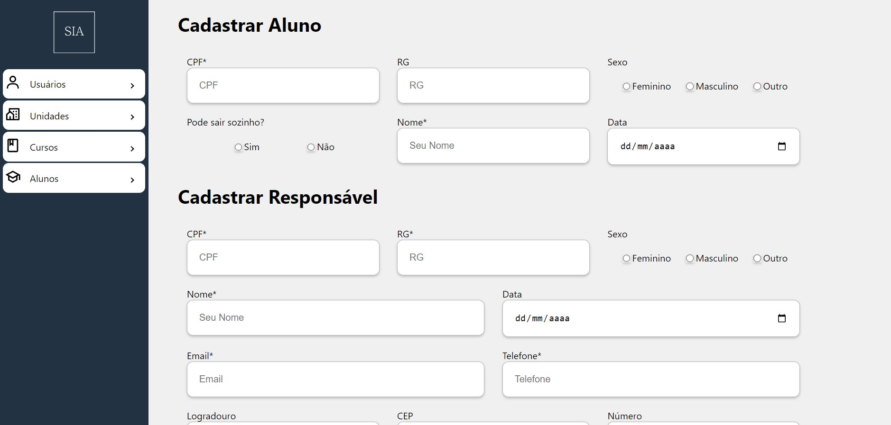

 

  

  <h3 align="center">Sierra India Alpha</h3>
  

    Projeto de sistema voltado a um empresa que fornece cursos profissionailizantes 
  

  
Índice

  <ol>
    <li>
      <a href="#about-the-project">Sobre o projeto</a>
      <ul>
        <li><a href="#built-with">Feito com</a></li>
      </ul>
    </li>
    <li>
      <a href="#getting-started">Getting Started</a>
      <ul>
        <li><a href="#prerequisites">Pre-requisitos</a></li>
        <li><a href="#installation">Instalação/a></li>
      </ul>
    </li>
    <li><a href="#contact">Contact</a></li>
  </ol>

## About The Project

<!-- Here's a blank template to get started: To avoid retyping too much info. Do a search and replace with your text editor for the following: `github_username`, `repo_name`, `twitter_handle`, `linkedin_username`, `email_client`, `email`, `project_title`, `project_description` -->

(<a href="#readme-top">back to top</a>)
